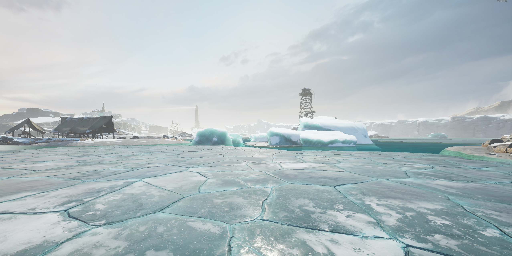

# Dread Hunger Modding Scripts

This repository contains two scripts that can be inserted into **Dread Hunger** using the **Frida tool**.

## Scripts Overview

### `add_things.js`
- Adds random icebergs at the start of the game, along with other features.
- Works exclusively on the **Expanse** map.
- Generates additional content at the start of the game, so no file uploads are necessary to play—just start the regular **Expanse** map.

---

### Concept of Random Icebergs Spawn

Here is the concept of the random icebergs' spawn locations:

There are 4 available routes:
1. 1 → 4  
2. 1 → 3 → 5  
3. 2 → 5  
4. 2 → 6  

At the start of the game, only one route will be chosen, while the others will spawn small icebergs. The captain can choose to navigate through them, but this will cause additional damage to the ship and significantly slow it down.

Example Iceberg Placements
Below are the visual examples of random iceberg placements:

**Iceberg Placement Example 1**

**Iceberg Placement Example 2**

**Iceberg Placement Example 3**

---

### Balancing Adjustments

To balance gameplay, the following adjustments have been made:

1. **Extra Coal in the Central Tower Zone**  
   

2. **Additional Skeletons and Meat for Thralls**  
   - Skeletons:  
       
   - Meat:  
     

3. **Extra Bed in the Nitro Zone**  
   

4. **Two Extra Buried Strongboxes in the Lighthouse Zone**  
    - Strongbox1:  
       
	 
	- Strongbox2:  
	   
	 
5. **Extra Crafting table in the Lighthouse Zone**  
	- CragtingTable: 
	   
---

### Spirit_walk_on_demand.js

- Allows players to exit Spirit Walk early before the timer expires.
- The trigger for exiting Spirit Walk is PutBoneDagger_Down (bound to the X key by default).
- Simply press the X key while in Spirit Walk to end it prematurely.

### Example
Below is an example of the script in action:

### Limitations
Does not work if Spirit Walk is cast while in a Prison Cell.
This is because the Bone Dagger is unavailable until you leave the cell.

---

